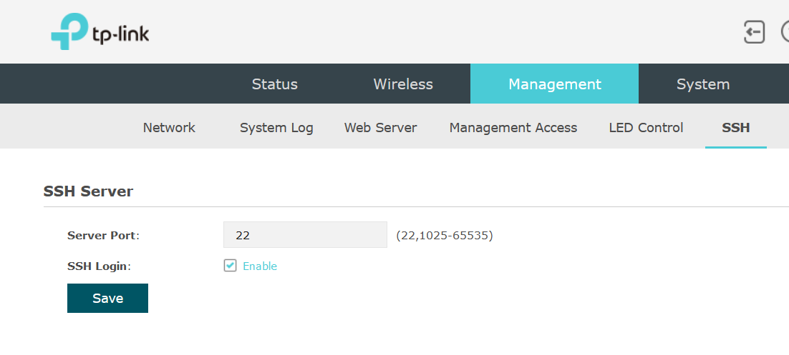

# TPLinkEAP225
TPLink EAP225 SSH custom component for Home assistant for detecting mac addresses

With this custom component, you'll be able to detect a single MAC address in a TPLInk EAP225 access point.

Here are the steps:

First, you need to log in the EAP225 and create an SSH access (Management - SSH - port: 22, enable)


Then, copy the custom_component in your Home Assistant Config subdirectory (the directory where configuration.yaml is)

You need to have a subdirectory named "custom_components" and in this subdirectory, create eap225 and in this eap225 subdirectory, copy the files

Then, in configuration.yaml, add the following:
```
eap225:
  # host is the ip of the EAP225 access point
  host: <<a.b.c.d>>
  # then you need to provide username and password to log into it (the same credentials you used in the web interface)
  username: <<example_username>>
  password: <<example_password>>
  cli_omada: true
  scan_interval: 15 //Min accepted interval is 15
```

The EAP 225 Series is shipped with different versions. Starting with EAP225 V4 - Firmware Version 5.2 the cli received a major update which is not compatible with the old ssh commands. If you have the new cli version please set "cli_omada: true" else "cli_omada: false"

Then, in your binary sensors (either the binary_sensors: section of configuration.yaml or your binary_sensors.yaml file)
```
binary_sensor:
  - platform: eap225 
    name: presence_mac1
    # make sure the mac address is lowercase and separated with :
    mac: aa:bb:cc:dd:ee:ff
```
Then restart home assistant, and you should have a new binary sensor named presence_mac1 that will follow the presence of this mac address on the eap225
You can create as many binary sensors as you want to follow different mac addresses.
